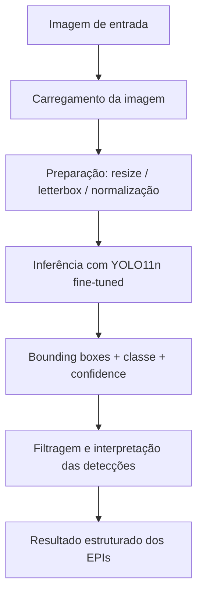
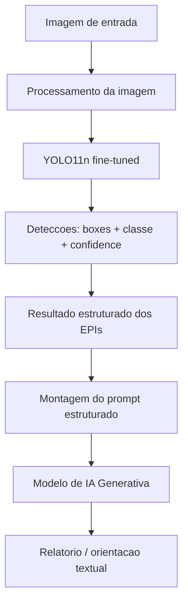

# Análise Visual de Equipamentos de Proteção Individual (EPIs) com Visão Computacional e IA Generativa

Projeto acadêmico integrado entre as disciplinas de **Processamento de Imagens e Sinais** e **Inteligência Artificial / IA Generativa**.

---

## Status do Projeto

Esta etapa corresponde ao **planejamento inicial e à documentação** do projeto.

Nenhum modelo foi treinado até o momento e a integração com IA Generativa ainda **não** foi implementada. Todo o conteúdo abaixo descreve o pipeline **proposto** e as decisões técnicas já tomadas. Treinamento, avaliação e integração generativa serão desenvolvidos nas etapas seguintes.

Não há, portanto, métricas, resultados experimentais ou demonstrações neste repositório.

---

## Integrantes

- Abner Wallace da Costa Rodrigues — RA 24111862
- Elidio Giacon Neto — RA 24111663
- Guilherme Martins Messa — RA 24111940
- Maria Antonia Rodrigues Vieira — RA 24111894
- Victor Silva Murakami — RA 24111697
- Vinicius Henrique Dalaqua da Silva — RA 24111678

---

## Descrição do Projeto

### Problema

A verificação do uso correto de Equipamentos de Proteção Individual em ambientes de trabalho é normalmente feita por inspeção humana, o que é trabalhoso, sujeito a falhas de atenção e difícil de registrar de forma padronizada.

### Proposta

Desenvolver um protótipo acadêmico capaz de:

1. analisar uma imagem contendo um trabalhador;
2. identificar, por visão computacional, a presença ou a ausência explícita de determinados EPIs;
3. converter esse resultado em um **dado estruturado**;
4. enviar esse dado estruturado a um modelo de **IA Generativa**, que produzirá um relatório textual de orientação.

### Objetivo

Demonstrar, de ponta a ponta, a integração entre uma etapa de processamento/análise de imagens e uma etapa de geração de linguagem natural, evidenciando a separação clara de responsabilidades entre as duas técnicas.

### Escopo do MVP

- uma imagem de entrada;
- um trabalhador principal por imagem;
- três EPIs: **capacete**, **colete** e **óculos de proteção**;
- saída estruturada + relatório textual.

### Relevância

O tema é relevante do ponto de vista acadêmico porque exige um pipeline completo e realista: dataset anotado, detecção de objetos, interpretação de resultados e geração de texto condicionada a dados estruturados.

**Importante:** trata-se de um **protótipo acadêmico**, não de um sistema industrial ou certificado de segurança do trabalho. Os resultados automáticos possuem limitações e não devem ser usados como base para decisões reais de segurança.

---

## Escopo

**Dentro do escopo inicial:**

- um trabalhador principal por imagem (sem associação de EPIs a múltiplas pessoas);
- classes positivas: `helmet`, `vest`, `goggles`;
- classes negativas explícitas: `no-helmet`, `no-vest`, `no-goggles`.

**Sobre as classes negativas:** o dataset escolhido possui anotações explícitas de ausência. Elas serão preservadas justamente para **evitar a inferência incorreta de que "não detectado" é o mesmo que "ausente"**. Uma detecção ausente pode significar apenas falha do modelo, oclusão ou baixa confiança.

**Fora do escopo inicial:**

- `boots` / `no-boots`;
- `gloves` / `no-gloves`;
- múltiplas pessoas por imagem;
- vídeo ou processamento em tempo real;
- interface gráfica.

**Ajuste futuro possível:** caso a classe `goggles` / `no-goggles` apresente qualidade claramente insuficiente durante os experimentos, o MVP poderá ser reduzido para capacete + colete. Essa redução **não** é a decisão atual, apenas um plano de contingência.

---

## Dataset

### Dataset principal

- **Nome:** PPE detection — dam
- **Plataforma:** Roboflow Universe
- **Link:** https://universe.roboflow.com/dam-zapvl/ppe-detection-qlq3d-i0ezw
- **Licença:** CC BY 4.0

**Características:**

- aproximadamente **5.140 imagens**;
- tarefa de **Object Detection**, com anotações em **bounding boxes**;
- divisão aproximada de 70% treino / 20% validação / 10% teste;
- exportação disponível em formatos compatíveis com YOLO.

**Classes disponíveis no dataset:**

`helmet`, `vest`, `goggles`, `boots`, `gloves`, `no-helmet`, `no-vest`, `no-goggles`, `no-boots`, `no-gloves`

**Classes que serão utilizadas:**

`helmet`, `no-helmet`, `vest`, `no-vest`, `goggles`, `no-goggles`

### Estratégia de uso dos dados

1. **Inspeção inicial:** será feita uma inspeção visual por amostragem para validar a qualidade das imagens e, principalmente, a consistência das annotations — com atenção especial a `goggles` / `no-goggles`.
2. **Filtragem:** as classes fora do escopo poderão ser removidas por um script simples de filtragem. Nenhum modelo adicional será criado apenas para selecionar amostras.
3. **Splits:** a divisão original de train / validation / test será preservada, evitando vazamento entre conjuntos.
4. **Volume:** não será fixado um limite artificial de imagens. O protótipo poderá usar um subconjunto representativo para validar o pipeline, e o treinamento final poderá usar todas as imagens relevantes após a filtragem, se fizer sentido.
5. **Diversidade:** será mantida diversidade de poses, iluminação e distância da câmera, evitando selecionar apenas imagens fáceis.

### Dataset alternativo

> **Observação:** como alternativa, caso o dataset principal apresente problemas relevantes de qualidade, foi identificado o dataset **PPE — caps Workspace** (Roboflow Universe, aproximadamente 16.223 imagens, CC BY 4.0): https://universe.roboflow.com/caps-workspace-sapoe/ppe-cpxsz-bkrmw
>
> Este dataset **ainda não foi escolhido para uso** e consta apenas como plano de contingência.

---

## Pipeline de Processamento de Imagens



**Etapa 1 — Carregamento da imagem.** A imagem é lida do disco e convertida para um array numérico (matriz de pixels), formato exigido pelas etapas seguintes.

**Etapa 2 — Preparação / resize / letterbox.** A imagem é redimensionada para a resolução de entrada esperada pela rede. O *letterbox* aplica o redimensionamento preservando a proporção original e preenchendo as bordas, o que evita distorcer objetos como capacetes e coletes. Também ocorre a normalização dos valores de pixel.

**Etapa 3 — Inferência com YOLO11n.** A imagem preparada é submetida ao modelo de detecção, que produz um conjunto de candidatos de detecção sobre a imagem inteira em uma única passagem.

**Etapa 4 — Bounding boxes, classe e confidence.** Cada detecção resultante contém as coordenadas da caixa delimitadora, a classe prevista e um valor de confiança. Detecções redundantes sobre o mesmo objeto são eliminadas por *Non-Maximum Suppression* (NMS).

**Etapa 5 — Filtragem e interpretação das detecções.** É a etapa de lógica própria do projeto: aplicação de limiar mínimo de confiança, descarte de classes fora do escopo e consolidação das detecções em um estado por EPI. Aqui será tratada explicitamente a distinção entre três situações: EPI identificado, ausência explicitamente identificada (classe negativa detectada) e resultado indeterminado (nenhuma das duas).

**Etapa 6 — Resultado estruturado.** A saída final da etapa de visão é um objeto estruturado, por exemplo:

```text
capacete: identificado
colete:   identificado
oculos:   ausencia explicitamente identificada
```

> **Nota sobre o framework:** boa parte do preprocessing, o NMS e a execução da inferência são gerenciados internamente pelo **Ultralytics**. Essas funcionalidades **não serão reimplementadas manualmente** sem necessidade; o esforço do projeto se concentra na preparação dos dados, no fine-tuning e na etapa de interpretação (etapas 5 e 6).

---

## Metodologia de Visão Computacional

- **Tipo de problema:** Object Detection.
- **Modelo:** YOLO11n (variante *nano*), com **pesos pré-treinados**.
- **Framework:** Ultralytics.
- **Estratégia de treinamento:** Transfer Learning / fine-tuning a partir dos pesos pré-treinados — a rede **não** será treinada do zero.

**Por que Object Detection.** O dataset escolhido já é anotado com *bounding boxes*. Converter o problema para classificação de imagem descartaria a informação de localização, sem simplificar o projeto de forma relevante. Além disso, a detecção permite tratar cada EPI como um objeto independente na cena.

**Por que YOLO11n com transfer learning.** Os pesos pré-treinados já codificam características visuais genéricas, o que reduz drasticamente a quantidade de dados e de tempo de treinamento necessários. A variante *nano* é a mais leve da família, adequada ao hardware disponível e ao prazo do projeto acadêmico.

---

## Integração com Inteligência Artificial

O projeto combina **duas IAs com responsabilidades distintas e não sobrepostas**.

### Pipeline completo



### Responsabilidades

| Componente | Responsabilidade |
| --- | --- |
| **Visão Computacional (YOLO11n)** | Identificar os EPIs na imagem e produzir um resultado estruturado e verificável. |
| **IA Generativa (LLM)** | Interpretar o resultado estruturado recebido e transformá-lo em uma resposta textual compreensível e contextualizada. |

A IA Generativa **não é responsável por detectar os EPIs** e não recebe a tarefa de analisar a imagem. Ela atua exclusivamente sobre o dado já estruturado pela etapa de visão.

### Exemplo conceitual

Entrada fornecida ao modelo generativo:

```text
Capacete: identificado
Colete: identificado
Óculos: ausência explicitamente identificada
```

Saída esperada: uma síntese textual do resultado da análise, acompanhada de orientação geral sobre o item cuja ausência foi identificada.

### Definição da ferramenta generativa

A API / modelo de IA Generativa **ainda não foi definida**. A escolha será feita posteriormente, durante a etapa de exploração da disciplina de IA Generativa, considerando disponibilidade, custo e adequação ao formato de prompt estruturado descrito acima. Por esse motivo, nenhum SDK de LLM consta no `requirements.txt` desta etapa.

---

## Limitações e cuidados

- **`goggles` é uma classe visualmente mais difícil:** óculos de proteção são objetos pequenos, frequentemente transparentes e sujeitos a oclusão, o que tende a reduzir a qualidade da detecção.
- **Qualidade das annotations:** o dataset é de origem pública e as anotações precisam ser inspecionadas antes do treinamento final.
- **Ausência de detecção ≠ ausência real:** a não detecção de uma classe positiva não será tratada como comprovação de que o EPI não está sendo usado.
- **Protótipo acadêmico:** o sistema não é uma solução certificada de segurança do trabalho e não substitui inspeção humana.
- **IA Generativa pode produzir texto incorreto:** por isso ela receberá contexto estruturado e restrito, e sua saída deverá ser avaliada criticamente, sem assumir que o texto gerado é automaticamente correto.

---

## Tecnologias planejadas

- Python
- Ultralytics / YOLO11n
- OpenCV

---

## Próximas etapas

1. Inspeção do dataset e da qualidade das annotations.
2. Preparação e filtragem das classes dentro do escopo.
3. Protótipo do pipeline com um subconjunto representativo.
4. Fine-tuning do YOLO11n.
5. Avaliação dos resultados.
6. Definição da ferramenta generativa e integração.
7. Demonstração final.

---

## Checklist da entrega

| Requisito do professor | Onde foi atendido |
| --- | --- |
| 1. Nome completo dos integrantes | Seção **Integrantes** |
| 2. Descrição detalhada do projeto, com o pipeline de processamento de imagens e explicação de cada etapa | Seções **Descrição do Projeto**, **Escopo**, **Pipeline de Processamento de Imagens** e **Metodologia de Visão Computacional** |
| 3. Descrição detalhada da integração com a disciplina de IA, com o pipeline completo | Seção **Integração com Inteligência Artificial** |
| 4. Arquivo `requirements.txt` | Arquivo [`requirements.txt`](requirements.txt) na raiz do repositório |
| 5. Link(s) do(s) dataset(s) utilizado(s) | Seção **Dataset** |
